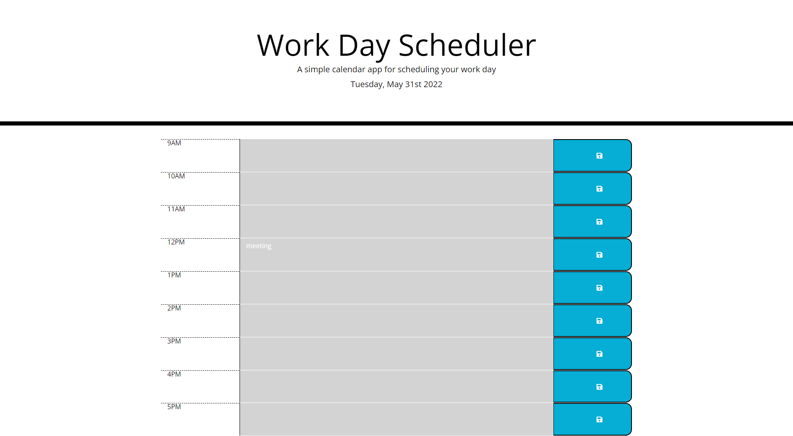

# WorkDayScheduler

## Table of Contents
1. [Description](#description)
2. [Visuals](#visuals)
3. [Resources](#resources)

## Description
An interactive planner/schedule for your workday plans. User can update information and save by clicking the save button. The data will not be erased when the page is refreshed. The colors of the rows will change colors based on what time of day it is.

## Visuals

## Resources
- [Live Site](https://selaprivette.github.io/WorkDayScheduler/) 
- [Repository](https://github.com/selaprivette/WorkDayScheduler)